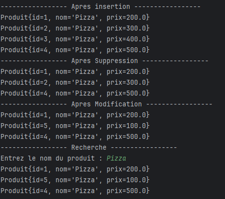

# `Produit` Class 

## Description
The `Produit` class represents a product in a system. It stores and manages information about a product, such as its ID (`id`), name (`nom`), and price (`prix`).

## Attributes
| Attribute | Type     | Description                                |
|-----------|----------|--------------------------------------------|
| `id`      | `long`   | The unique identifier of the product.      |
| `nom`     | `String` | The name of the product.                   |
| `prix`    | `double` | The price of the product.                  |

### Constructors
- `Produit()` : Default constructor.
- `Produit(long id, String nom, double prix)` : Constructor with parameters to initialize the product's ID, name, and price.

### Getter/Setter Methods
- `getId()` : Returns the product's ID.
- `setId(long id)` : Sets the product's ID.
- `getNom()` : Returns the product's name.
- `setNom(String nom)` : Sets the product's name.
- `getPrix()` : Returns the product's price.
- `setPrix(double prix)` : Sets the product's price.

### `toString()` Method
- `toString()` : Returns a string representation of the product, including its ID, name, and price.

# `GestionProduitApp` Class

## Description
The `GestionProduitApp` class is a simple Java application that manages a list of `Produit` objects. It demonstrates basic operations such as adding, removing, modifying, and searching products in a list. The program uses Java collections (`ArrayList`) to store the products and performs operations on them.

## Workflow
- **Insertion**: The program first inserts several `Produit` objects into the list.
- **Deletion**: A product is removed from the list based on its index.
- **Modification**: One of the products in the list is updated with new information.
- **Search**: The program prompts the user to enter a product name and searches for matching products in the list.

## Attributes
- **`list`**: A list of `Produit` objects, stored in an `ArrayList`.

### Main Method
- `main(String[] args)` : The entry point of the program where the operations are performed. It:
    1. Initializes the `list` with some `Produit` objects.
    2. Performs insertion, deletion, modification, and searching of products.
    3. Prompts the user to search for products by name and displays the results.

### Operations Performed
1. **Insertion**: Adds predefined `Produit` objects to the list.
2. **Removal**: Removes a `Produit` object from the list at a specific index.
3. **Modification**: Replaces a `Produit` object at a specific index with a new one.
4. **Search**: Filters the list to find a product by its name, using a case-insensitive comparison.

## Example Output
The application will print the following types of outputs:

******

