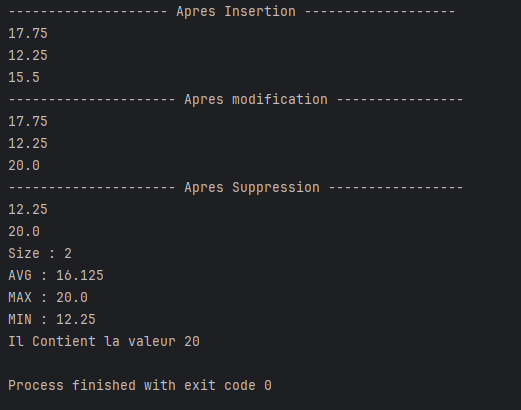

# `Main` Class 

## Description
The `Main` class demonstrates the usage of a `HashMap` in Java to manage key-value pairs. This class provides operations for inserting, modifying, removing, and analyzing data stored in the map. The values in the map represent numerical data, and the class performs various operations like calculating average, maximum, and minimum values, as well as checking for the existence of specific values.

## Attributes
- **`qde`**: A `HashMap<String, Double>` where the key is a `String` (name) and the value is a `Double` (some numeric value associated with the name).

### Main Method
- `main(String[] args)` : The entry point of the program where various operations on the `HashMap` are performed. It:
    1. Inserts key-value pairs into the map.
    2. Modifies the value of an existing key.
    3. Removes a key-value pair from the map.
    4. Prints the current values in the map after each operation.
    5. Displays the size of the map.
    6. Calculates and prints the average, maximum, and minimum values stored in the map.
    7. Checks if the map contains a specific value and prints the result.

### Operations Performed
1. **Insertion**: Adds key-value pairs into the map.
2. **Modification**: Updates the value of an existing key (`Jane` in this case).
3. **Removal**: Removes the entry with the key `"Doe"`.
4. **Size**: Displays the size of the map after modifications.
5. **Average**: Computes the average of all values stored in the map.
6. **Maximum**: Finds the maximum value in the map.
7. **Minimum**: Finds the minimum value in the map.
8. **Contains Value**: Checks whether the map contains a specific value (20.0).

## Example Output
******
