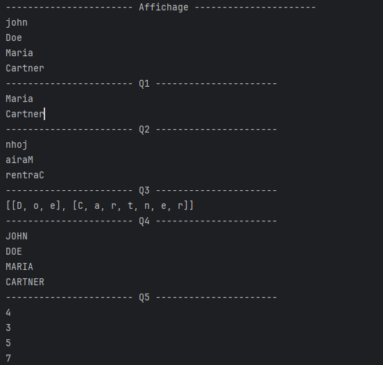
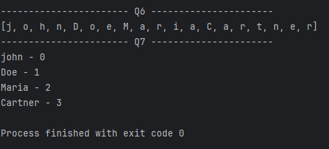

# `Main` Class 

## Description
The `Main` class demonstrates various operations on a `List<String>` in Java using the `Stream` API. It performs several queries on a list of names, including filtering, mapping, and transforming data. The program showcases different ways to manipulate and process data using streams and lambda expressions.

## Attributes
- **`list`**: A `List<String>` containing a few names (`"john"`, `"Doe"`, `"Maria"`, `"Cartner"`).

### Main Method
- `main(String[] args)` : The entry point of the program where multiple operations on the `list` are performed:
    1. **Display**: Prints all elements of the list.
    2. **Q1**: Filters and prints the elements that contain the letter "a".
    3. **Q2**: Filters elements that have more than 3 characters, reverses them, and prints the result.
    4. **Q3**: Splits elements containing the letter "e" into lists of characters and prints the result.
    5. **Q4**: Converts all elements in the list to uppercase and prints them.
    6. **Q5**: Maps each element to its length and prints the lengths.
    7. **Q6**: Flattens the list of names into individual characters and prints the result.
    8. **Q7**: Combines each element with its index and prints the resulting string.

### Operations Performed
1. **Display**: Prints all names in the list.
2. **Q1**: Filters the list to display elements containing the letter "a".
3. **Q2**: Filters elements with more than 3 characters, reverses each element, and prints the results.
4. **Q3**: Filters elements containing the letter "e", splits them into individual characters, and collects them as lists.
5. **Q4**: Converts all strings in the list to uppercase.
6. **Q5**: Maps each string in the list to its length and prints the result.
7. **Q6**: Flattens the list of names into a stream of individual characters.
8. **Q7**: Combines each element with its index and prints the result in the form of "element - index".

## Example Output
******
******
