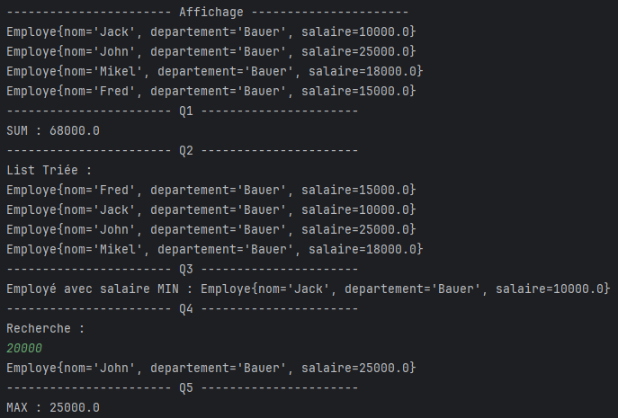

# `Employe` Class

## Description
The `Employe` class represents an employee with attributes such as `nom` (name), `departement` (department), and `salaire` (salary). This class provides getter and setter methods for these attributes, as well as a constructor for initializing them. Additionally, it overrides the `toString()` method to provide a string representation of the `Employe` object.

## Attributes
- **`nom`** (`String`): The name of the employee.
- **`departement`** (`String`): The department in which the employee works.
- **`salaire`** (`double`): The salary of the employee.

### Constructors
- **`Employe()`**: A default constructor to create an empty `Employe` object.
- **`Employe(String nom, String departement, double salaire)`**: A parameterized constructor to create an `Employe` object with specified values for `nom`, `departement`, and `salaire`.

### Getter and Setter Methods
- **`getNom()`**: Returns the name of the employee.
- **`setNom(String nom)`**: Sets the name of the employee.
- **`getDepartement()`**: Returns the department of the employee.
- **`setDepartement(String departement)`**: Sets the department of the employee.
- **`getSalaire()`**: Returns the salary of the employee.
- **`setSalaire(double salaire)`**: Sets the salary of the employee.

### `toString()` Method
- **`toString()`**: Returns a string representation of the `Employe` object, including the employee's name, department, and salary.

# `Main` Class 

## Description
The `Main` class demonstrates various operations on a list of `Employe` objects using Java Streams. It includes functionality for displaying employee details, calculating sums, finding minimum and maximum salaries, filtering employees based on salary, sorting employees, and concatenating employee names.

## Attributes
- **`list`** (`List<Employe>`): A list containing `Employe` objects with details such as name, department, and salary.

## Methods

### Main Method
- `main(String[] args)` : The entry point of the program where the following operations are performed:
    1. **Display**: Prints all employee details.
    2. **Q1**: Calculates and prints the sum of all employee salaries.
    3. **Q2**: Sorts the employees by their names and prints the sorted list.
    4. **Q3**: Finds and prints the employee with the minimum salary.
    5. **Q4**: Filters and prints employees with a salary greater than a user-specified value.
    6. **Q5**: Finds and prints the maximum salary from the list.
    7. **Q6**: Concatenates all employee names into a single string and prints the result.

### Operations Performed
1. **Display**: Prints all employees in the list.
2. **Q1**: Sums the salaries of all employees and prints the total.
3. **Q2**: Sorts employees alphabetically by their name (`nom`) and prints the sorted list.
4. **Q3**: Finds the employee with the minimum salary and prints their details.
5. **Q4**: Prompts the user for a salary value and filters employees whose salary is greater than the entered value, printing the matching employees.
6. **Q5**: Finds and prints the maximum salary from the list of employees.
7. **Q6**: Concatenates all employee names into a single string and prints the result.

## Example Output
******
******

